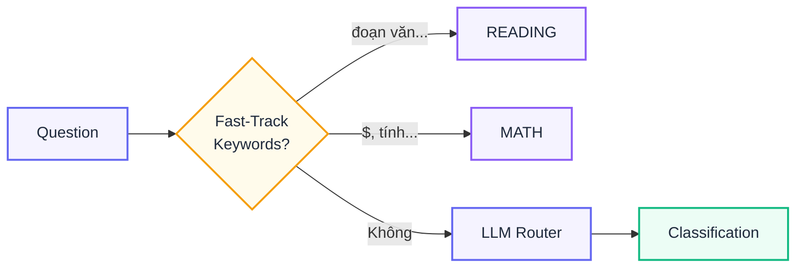
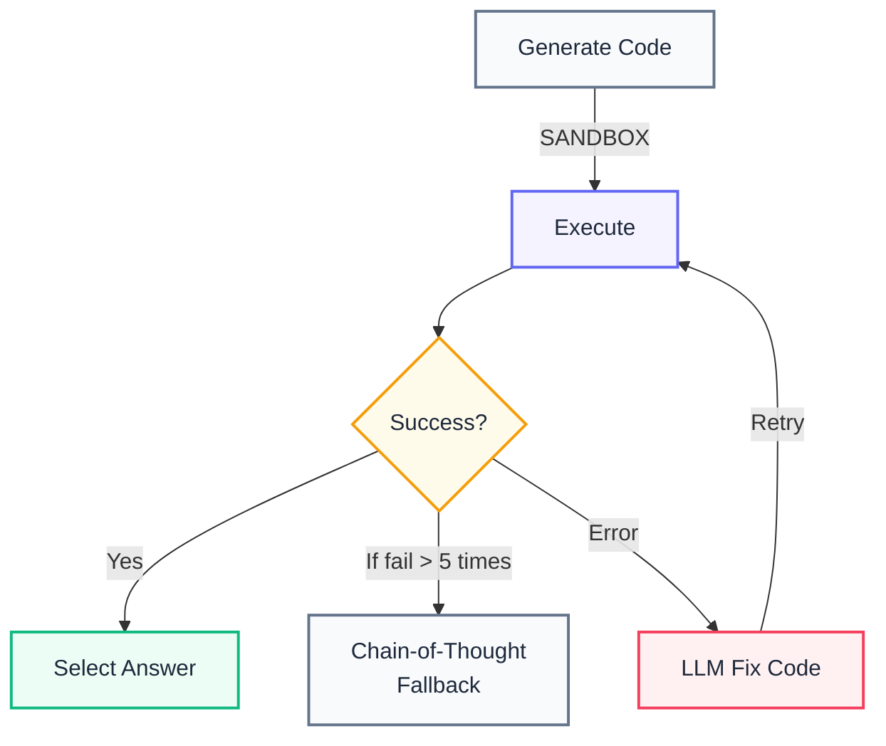
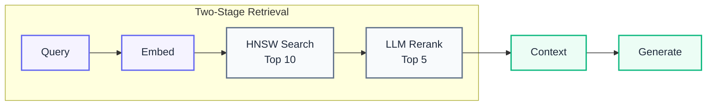
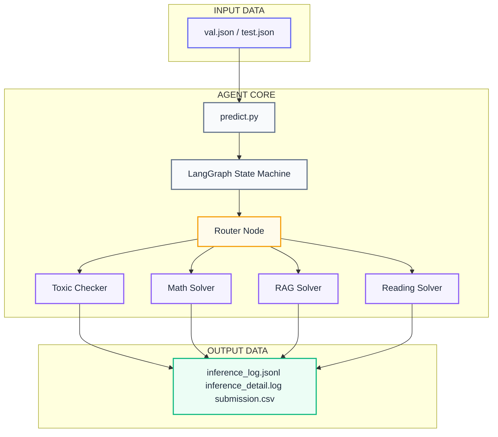
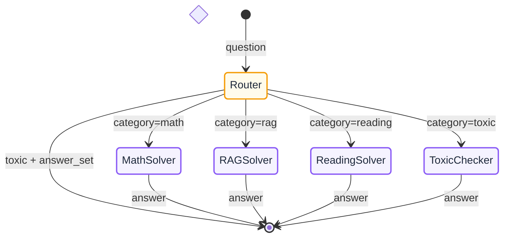
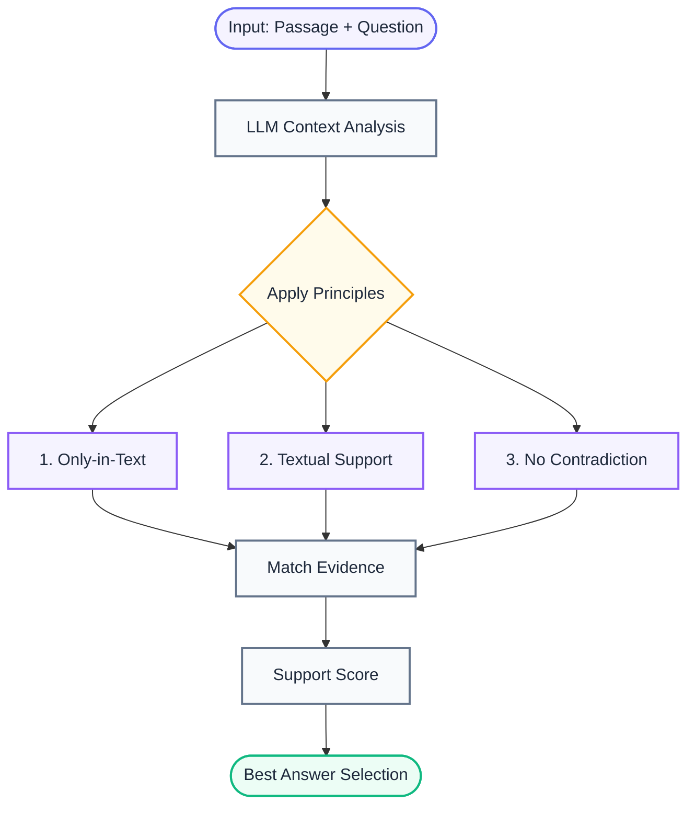
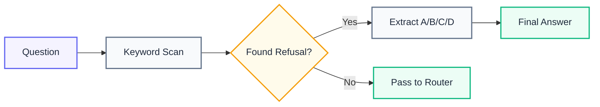
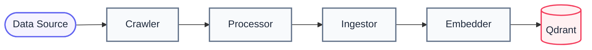

# VNPT AI Hackathon - Technical Documentation

<div align="center">


**Vietnamese Multi-Choice Question Answering System**

*Intelligent Agent Pipeline with Multi-Domain RAG, Code Execution, and Self-Healing Inference*

</div>

## Table of Contents

1. [Project Structure](#project-structure)
2. [Overview System](#overview-system)
3. [Highlight Features](#highlight-features)
4. [System Architecture](#system-architecture)
5. [Agent Pipeline](#agent-pipeline)
6. [Data Pipeline](#data-pipeline)
7. [Usage Guide](#usage-guide)

## Project Structure

```
project/
├── src/                        
│   ├── agent/                    # LangGraph agent
│   │   ├── graph.py              # Main agent graph
│   │   ├── router.py             # Question classifier
│   │   ├── state.py              # AgentState TypedDict
│   │   └── modules/              # Solver modules
│   │       ├── math/             # Math solver
│   │       ├── rag/              # RAG solver
│   │       ├── reading/          # Reading solver
│   │       └── toxic/            # Toxic checker
│   ├── client.py                 # VNPT API wrapper
│   ├── config.py                 # Centralized config
│   ├── answer.py                 # Answer extraction
│   └── logger.py                 # Real-time logging
│
├── data_pipeline/                # Data processing
│   ├── crawler_*.py              # Web crawlers
│   ├── ingest_*.py               # Text processing
│   └── embedder.py               # Vector embedding
│
├── data/                         # Data storage
│   ├── qdrant_storage/           # Vector DB (3.6GB), ignore this folder
│   └── val.json, test.json       # Input data
│
├── output/                       # Results
│   ├── inference_log_*.jsonl     # Inference logs
│   ├── inference_detail.log      # Debug traces
│   └── submission_*.csv          # Final submissions
│
├── predict.py                    # Main inference script
├── Dockerfile                    # Container definition
├── docker-compose.qdrant.yml     # Qdrant setup
├── inference.sh                  # Inference script
└── pyproject.toml                # Dependencies
```

## Overview System

### Objectives
We developed a high-precision system for answering Vietnamese multiple-choice questions. This system is designed to effectively handle **4 distinct question types**:

| Type | Description | Processing Method |
|------|-------|-------------------|
| **MATH** | Math problems | Generate Python code + Safe execution |
| **READING** | Reading comprehension | Context analysis + Logical reasoning |
| **RAG** | Knowledge retrieval | Vector search + LLM reranking |
| **TOXIC** | Out-of-scope questions | Toxic pattern detection |

### Performance Metrics

```
┌─────────────────────────────────────────────────────────┐
│  PERFORMANCE METRICS                                    │
├─────────────────────────────────────────────────────────┤
│  1. Validation Accuracy:     85-91% (on val set)        │
│  2. Avg Latency (RAG):       3-4 seconds                │
│  3. Avg Latency (Math):      9-16 seconds               │
│  4. Avg Latency (Reading):   2-3 seconds                │
│  5. Rate Limit Handling:     Auto-recovery              │
│  6. Vector DB Size:          3.6GB (~556K vectors)      │
└─────────────────────────────────────────────────────────┘
```

## Highlight Features

### Key Features

#### 1. **Hybrid Router with Fast-Track Detection**

> **Idea**: Save API calls by detecting keywords before calling LLM, based on the number of toxic and math questions

---

#### 2. **Self-Correcting Code Execution**

> **Idea**: Math solver has the ability to **self-correct** code up to 5 times before falling back (The code typically achieves correctness and successful execution after approximately one retry attempt).

---

#### 3. **Multi-Domain RAG with LLM Reranking**

> **Idea**: Combine **vector search** + **LLM rerank** to improve recall and precision.

---

#### 4. **Auto-Healing Inference Pipeline**
```python
# predict.py Features
1. Auto-Resume      # Automatic Checkpoint Resumption
2. Hourly Quota     # Automatic Hourly Quota Reset Wait
3. Graceful Stop    # Graceful Shutdown via STOP_AUTO File
4. Rate Limit Retry # Retry 5 times before waiting for quota
```
> **Idea**: "Fire-and-forget" inference - runs overnight without monitoring

---

#### 5. **Parallel Embedding with Rate Limit Safety**
```
┌────────────────────────────────────────────────────────┐
│  EMBEDDER FEATURES                                     │
├────────────────────────────────────────────────────────┤
│  1. n-Worker Thread Pool (concurrent embedding)        │
│  2. 480 RPM Rate Limiter (safety margin)               │
│  3. Continuous Embedding (re-embed on update)          │
│  4. Checkpoint Sync (recover from Qdrant if file lost) │
└────────────────────────────────────────────────────────┘
```

## System Architecture

### High-Level Architecture



### Technology Stack

```
┌─────────────────────────────────────────────────────────┐
│  TECHNOLOGY STACK                                       │
├─────────────────────────────────────────────────────────┤
│  Agent Framework:  LangGraph (State Machine)            │
│  Vector DB:        Qdrant (HNSW + BM25)                 │
│  LLM Provider:     VNPT AI API (Small + Large + Embed)  │
│  Language:         Python 3.11                          │
│  Package Manager:  uv                                   │
│  Container:        Docker                               │
│  Web Crawler:      Selenium + BeautifulSoup + Firecrawl │
└─────────────────────────────────────────────────────────┘
```

## Agent Pipeline

### LangGraph State Machine



### Agent State Schema

```python
class AgentState(TypedDict):
    question: str      # "Tính tích phân..."
    qid: str           # "val_0001"
    choices: List[str] # ["A. 5", "B. 10", ...]
    category: str      # "math" | "rag" | "reading" | "toxic"
    context: str       # Retrieved context
    answer: str        # "A" | "B" | "C" | "D"
    reasoning: str     # "Computed: 10 matches B"
```

---

### Module Detail: Math Solver

**Features**:
- Safe execution
- Self-Correcting Code Execution
- Isolated namespace
- Capture stdout/stderr
- Timeout protection
- Support SymPy, NumPy, SciPy, OR-Tools, other math packages
- Use 3 models with 3 different tasks: code generator, code fixer, math reasoning.

---

### Module Detail: RAG Solver

```mermaid
flowchart LR
    classDef indigo fill:#f5f3ff,stroke:#6366f1,stroke-width:2px,color:#1e293b
    classDef slate fill:#f8fafc,stroke:#64748b,stroke-width:2px,color:#1e293b
    classDef emerald fill:#ecfdf5,stroke:#10b981,stroke-width:2px,color:#1e293b

    subgraph Retrieval["Stage 1: Retrieval"]
        Q["Query + Options"]:::indigo --> EMB["Query Embed<br>(VNPT Embed - 1024D)"]:::indigo
        EMB --> HNSW["HNSW Search<br>ef=128, Top 10"]:::slate
    end
    
    subgraph Rerank["Stage 2: Rerank"]
        HNSW --> DOCS["10 Documents"]:::slate
        DOCS --> LLM_R["LLM Rerank<br>(VNPT Small)"]:::slate
        LLM_R --> TOP5["Top 5 Relevant"]:::slate
    end
    
    subgraph Generate["Stage 3: Answer"]
        TOP5 --> CTX["Build Context<br>(max 4000 chars)"]:::emerald
        CTX --> LLM_G["Generate Answer<br>(VNPT Large)"]:::emerald
        LLM_G --> EXTRACT["Extract A/B/C/D"]:::emerald
    end
```



**RAG Config**:
| Parameter | Value | Description |
|-----------|-------|---------|
| `TOP_K` | 10 | Number of docs retrieved |
| `RERANK_TOP_K` | 5 | Number of docs after rerank |
| `MIN_SCORE` | 0.35 | Cosine similarity threshold |
| `MAX_CONTEXT_CHARS` | 4000 | Context length limit |
| `HNSW_EF` | 128 | HNSW search accuracy |

---

### Module Detail: Reading Solver



**Principles**:
1. **Only-in-Text**: The context (paragraph) and the question already provided in the input.
2. **Textual Support**: The answer must be supported by the context (paragraph).
3. **No Contradiction**: The answer must not contradict the context (paragraph).

---

### Module Detail: Toxic Checker



**Logic**:
- Check if the question contains keywords (e.g., "tôi không thể", "trái pháp luật", "nằm ngoài phạm vi").
- If the question contains keywords, extract the answer (A/B/C/D).
- If the question does not contain keywords, pass the question to the router.

## Data Pipeline

### Data Pipeline Overview



### Chunking Strategy

We employ domain-specific chunking strategies to maximize retrieval quality:

#### 1. Legal Documents (VBPL/TVPL)
**Strategy**: `Article-based Chunking`
- **Problem**: Legal texts have strict hierarchy (Chapter > Section > Article). Random splitting breaks context.
- **Solution**:
    - Regex-based splitting by "Điều X".
    - **Context Enrichment**: Prepend hierarchy headers to every chunk.
    - *Format*: `[Luật Đất đai 2024] - [Chương I] - Điều 5: Nguyên tắc sử dụng đất`
    - **Fallback**: Semantic block splitting for unstructured texts.

#### 2. Wikipedia (ViWiki2025)
**Strategy**: `Recursive Character Splitter`
- **Problem**: Wiki articles are long and unstructured.
- **Solution**:
    1. Split by Section `== Header ==`.
    2. Recursive split by `\n\n` (Paragraphs).
    3. Split by `.` (Sentences) if paragraphs are too long.
- **Cleaning**: Remove "Tham khảo", "Xem thêm", template tags, and citations.

#### 3. MCQ Data (DeThiTracNghiem)
**Strategy**: `JSON Preservation`
- **Logic**: Keep Question + Options together as a single atomic unit.
- **Metadata**: Preserve `grade`, `subject`, and `correct_answer` for potential training.

## Usage Guide
### 1. Clone the repository

```bash
# Clone the repository
git clone https://github.com/baeGil/vnptAI-Hackathon-2025.git
cd project
```
### 2. Install dependencies

```bash
uv sync
```

### 3. Configure Environment 
Create a .env file in the root directory:

```bash
# Embedding model credentials
VNPT_EMBEDDING_API_KEY=xxx
VNPT_EMBEDDING_TOKEN_KEY=xxx
VNPT_EMBEDDING_TOKEN_ID=xxx

# LLM Large model credentials
VNPT_LARGE_API_KEY=xxx
VNPT_LARGE_TOKEN_KEY=xxx
VNPT_LARGE_TOKEN_ID=xxx

# LLM Small model credentials
VNPT_SMALL_API_KEY=xxx
VNPT_SMALL_TOKEN_KEY=xxx
VNPT_SMALL_TOKEN_ID=xxx

# API Base URL
VNPT_API_BASE_URL=https://api.idg.vnpt.vn/data-service/v1/chat/completions

# Paths (default for local testing, Docker will override via environment)
DATA_DIR=./data # Can keep default
OUTPUT_DIR=./output # Can keep default

# Firecrawl API KEY
FIRECRAWL_API_KEY=xxx
```
### 4. Vector Database

For local development and testing, you can start a clean Qdrant instance:

```bash
# Start Qdrant container
docker-compose -f docker-compose.qdrant.yml up -d

# Verify
curl http://localhost:6333/collections
```

### 5. Local Inference

```bash
# Manual mode
uv run predict.py

# Auto mode (wait until quota reset)  RECOMMENDED
uv run predict.py --auto

# Graceful stop
touch STOP_AUTO   # Script will stop after current question
# or press 
Ctrl + C # to stop immediately
```

**Run with Docker Hub Image**

The project is fully containerized for submission. The image contains:
- **Environment**: CUDA 12.2, Python 3.11, Ubuntu 22.04.
- **Data**: Pre-built Qdrant index (3.6GB) baked into the image.
- **Automation**: Self-healing inference script with auto-retry.

```bash
# 1. Pull the image
docker pull baegil/underdog_submission:latest

# 2. Run inference (mount your private_test.json)
rm -rf output_btc && mkdir output_btc && docker run --rm \
  -v $(pwd)/test.json:/code/private_test.json \
  -v $(pwd)/output_btc:/code/output \
  --env-file .env \
  baegil/underdog_submission:latest
```
> **Note**: When running a new test cycle, make sure:
> - All previous output files **must be cleared beforehand**. 
> - Create a new test.json file in the root directory, same format as data/test.json or data/val.json.
> - Already created .env file in the root directory and filled all the required fields.

**Auto Mode Flow**:
```
Question 1 → Answer → Next
Question 2 → Answer → Next
...
Question N → Rate Limit Detected!
           → Retry 5 times (30s delay each)
           → Still fail? Wait until next hour (:00)
           → Resume automatically
           → Continue until finished
```
**Output format**:
```bash
qid,answer
Q001,A
Q002,B
```
<div align="center">

**Built for VNPT AI Hackathon 2025**

*Team Underdog - AIO2025*
</div>